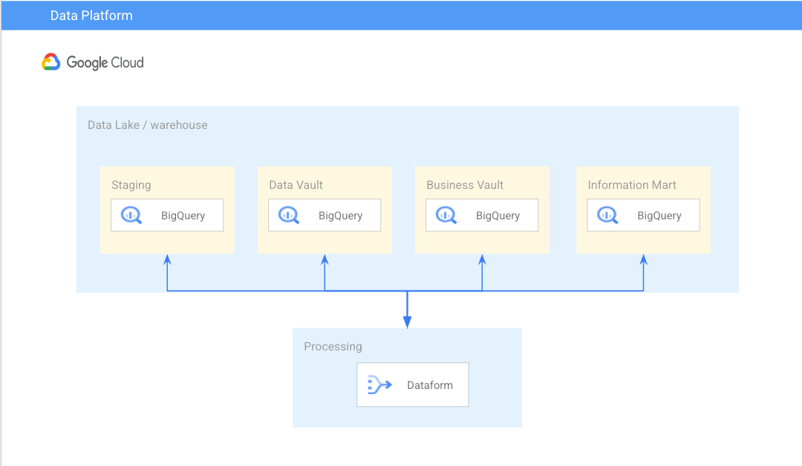
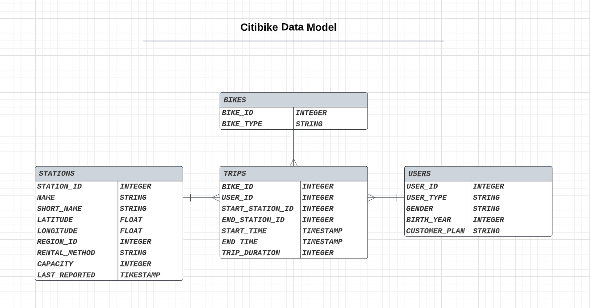
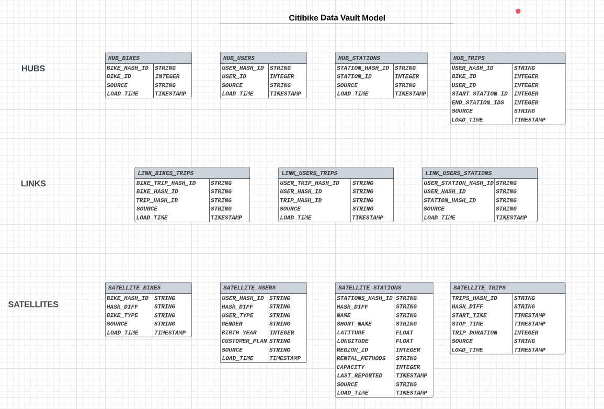
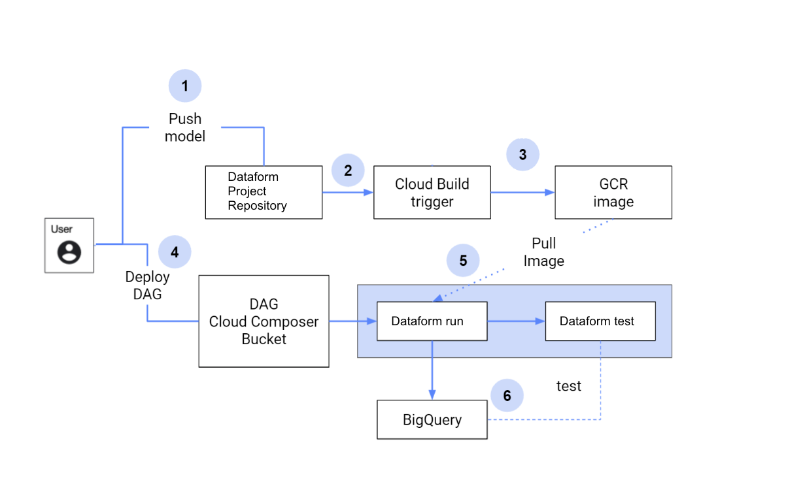
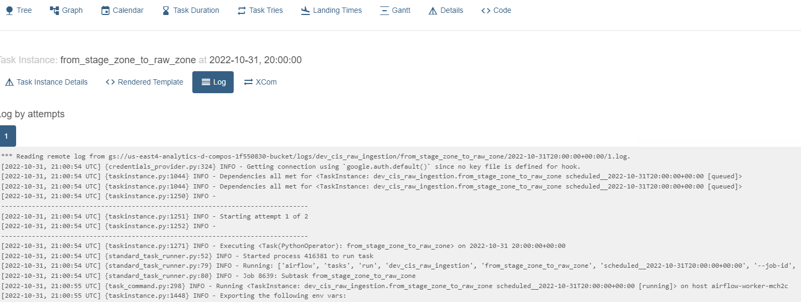
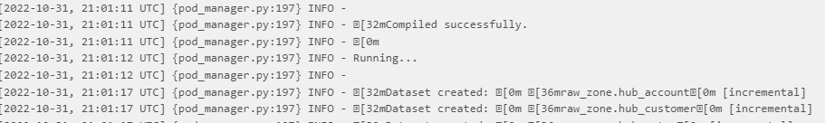
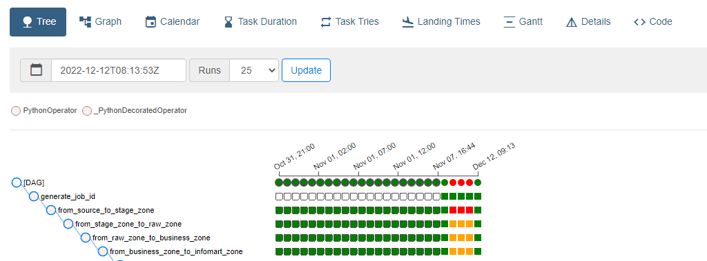

# DVForm
Dataform utility library that allow you to build a data vault model using a configuration based technique. 


## What is Data Vault ? 
Data vault is a relatively new design methodology for data warehouses. Data vaults store raw data as-is without applying business rules. Data transformation happens on-demand, and the results are available for viewing in a department-specific data mart. While a traditional data warehouse structure relies on extensive data pre-processing, the data vault model takes a more agile approach. This can help tackle difficult use cases, although it’s not always easy to implement.

###  Advantages of the Data Vault
* Raw Data Retention
* Simpler Transformations
* Decoupling of Rules and Data
* Department-Specific Data Transformations

### Disadvantages of a Data Vault
* Increased Resource Usage
* Expanded Data Storage
* Solution Complexity
* Slower Data Mart Results


## Data Vault Architecture Layers
* **Staging Layer** does not apply any changes to the data, it provides a temporary area to support the process of moving data from various sources into the Data Warehouse.
* **Raw Vault** stores persistently the data in a model built around the identification of the business keys in the data sources.
* **Business Vault** in which we deal with Soft Business Rules, Data Quality. There are many reasons to refactor it over time.
* **Information Mart** is needed because data in the Business Vault is still in the Hub, Link, Satellite shape and has to be shaped as expected by the final business user (e.g., star schema, feature store for Data Mining etc)

All these layers can be stored and maintained in separated BigQuery datasets as shown in below architecture diagram 

 

## CitiBike Example

Citibike entities are ingested into Stage Layer where we are keeping the data without applying any changes to it. <br/><br/>
 


### The Data Vault Model consists of 3 concepts:<br/>

  * **Hub Tables**: collects all the business keys present in a source entity for each Hub table we add 3 columns.
  
    | **Column**    | **Description**                                                                                                                                           | 
    |-----------|:------------------------------------------------------------------------------------------------------------------------------------------------------|
    | **Hash_Id**   | A new String column to uniquely identify a record in the hub table, and it’s calculated based on the business keys. e.g   user_hash_id : md5(user_id) |
    | **Source**    | A new String column to capture the source data location / table.                                                                                      |           
    | **Load_Time** | A new Timestamp column to represent the ingestion time into the table.                                                                                |

  * **Link Tables**: represents as N-to-N relationship and uses the business keys to connect 2 Hubs for each Link table we add 3 columns.
  
    | **Column**        | **Description**                                                                                                                   |                                                                                                                             
    |:--------------|:------------------------------------------------------------------------------------------------------------------------------|
    | **Hash_Id**   | A new String column to uniquely identify a record in the link table. e.g. bike_trip_hash_id : md5(bike_hash_id, trip_hash_id) |
    | **Source**    | A new String column to capture the source data location / table.                                                              |
    | **Load_Time** | A new Timestamp column to represent the ingestion time into the table.                                                        |
     
  * **Satellite Tables** :  store all data that describes a row in a Hub or a Link for each satellite table we add 4 columns.

    | **Column**    | **Description**                                                                                                                            |                                                                                                                             
    |:--------------|:-------------------------------------------------------------------------------------------------------------------------------------------|
    | **Hash_Id**   | A new String column to refer to the hub hash id. e.g   user_hash_id                                                                        |
    | **Hash_diff** | A new String column to uniquely identify non-business key columns. e.g. users hash_diff: md5(user_type, gender, birth_year, customer_plan) |
    | **Source**    | A new String column to capture the source data location / table.                                                                           |
    | **Load_Time** | A new Timestamp column to represent the ingestion time into the table.                                                                     |

So we need to change the citibike data model as below to store it at the **data vault Layer**

 

## How to use DVForm to create a data vault model ? 

DVForm is a utility library based on Dataform that allow you to create easily create you data vault model in a generic, automated and configurable way.

### Installation 

Add the package to your package.json file in your Dataform project. You can find the most up-to-date package version on the [releases page](https://github.com/mokhahmed/dvform/releases).
or you can download the index.js file and import it into `includes/index.js` then you can it from js or sqlx scripts for more details refer to [reuse code guide](https://cloud.google.com/dataform/docs/reuse-code-includes) 

```
{
  "name": "demo",
  "dependencies": {
    "@dataform/core": "2.0.1",
    "dvform":"https://github.com/mokhahmed/dvform/archive/0.1.tar.gz"
    }
}
```

### Usage

#### 1. create citibike entities configuration `includes/models.js`  [citibike models example](examples/includes/models.js) <br/>

  * **Define the entity configurations in the following structure <br/>**

    | Record Name          | Description                                               |
    |:---------------------|:----------------------------------------------------------|
    | name                 | String of the name for the entity e.g. (users, bikes, ..) |
    | columns              | Array of columns object structure                         |
    | columns_descriptions | Array of columns description object structure             |

    **example** 
    
    ```
    var entity_example = {
      "name": "entity_name",
      "columns": entity_columns_obj,
      "columns_descriptions": entity_columns_descriptions_obj
    }
    ```

    * **Define the entity columns configurations in the following structure <br/>**

      | Record Name        | Description                                                                                  |
      |----------------------------------------------------------------------------------------------|:---------------------------------------------------------------------------------------------|
      | source_column_name | String for the name for the column in the source table e.g. (users_id,user_type, ..)         |
      | source_data_type   | String for the data type of the column in the source table  (stirng , int, float, timestamp) |
      | target_column_name | String for the name for the column in the source table e.g. (users_id,user_type, ..)         |
      | target_data_type   | String for the data type of the column in the target table  (stirng , int, float, timestamp) |
      | is_key             | "Y/N" yes or no flag represents if this column is a unique business key                      |
      | is_calculated      | "Y/N" yes or no flag if this column is calculated based on external logic                    |
      | calculated_by      | String for the sql logic to be applied for this column                                       |
      | description        | String description for the column that should appear at BigQuery Documentation                |
  
      **example** 
      ```
        var entity_columns_obj =  [{
            "source_column_name": "col1",
            "source_data_type": "integer",
            "target_column_name": "col2",
            "target_data_type": "integer",
            "is_key": "Y",
            "is_calculated": "N",
            "calculated_by": "",
            "description": "col2 breif description"
          }, ... ]
      ```
  * **Define the entity columns configurations in the following structure**
    
    | Record Name   | Description                                                                    |
    |:--------------|:-------------------------------------------------------------------------------|
    | <COLUMN_NAME> | String for the column description the should appear in bigquery documentations |
    
    example 
    ```
      var entity_columns_descriptions_obj =  [{
          "col2": "col2 breif description",
        }, ... ]
    ```


### you have 3 options to use DVForm based on the level of customization required

* **Using `create_data_vault_from_model` api. e.g. [easy_setup example](examples/definitions/easy_setup.js)**
 
```
create_data_vault_from_model(
    load_id,
    source_schema_name,
    stage_schema_name,
    data_vault_schema_name,
    source_tables_prefix,
    stage_tables_prefix,
    hubs_tables_prefix,
    satellites_tables_prefix,
    links_tables_prefix,
    tables_type,
    all_models,
    links_tables
)
```

| Argument                 | Description                                                    |
|:-------------------------|:---------------------------------------------------------------|
 | load_id                  | String for a unique id to differentiate between different runs |
| source_schema_name       | String for source tables dataset name                          |
| stage_schema_name        | String for staging tables dataset name                         |
| data_vault_schema_name   | String for data vault tables dataset name                      |
| source_tables_prefix     | String for source tables prefix or empty if not applicable     |
| stage_tables_prefix      | String for stage tables prefix or empty if not applicable      |
| hubs_tables_prefix       | String for hub tables prefix or empty if not applicable        |
| satellites_tables_prefix | String for satellites tables prefix or empty if not applicable |
| links_tables_prefix      | String for links tables prefix or empty if not applicable      |
| tables_type              | String for tables type (incremental/ table / view)             |
| all_models               | List for all entities objects                                  |
| links_tables             | List of link tables to be created                              |

* create layer by layer [stage](examples/definitions/examples/js/stg), [data-vault](examples/definitions/examples/js/dvm), ... 

for example create the staging layer tables
```
create_staging_tables(
    load_id, 
    schema_name, 
    source_tables_prefix, 
    target_tables_prefix, 
    tables_type, 
    staging_tables
)
```

| Argument             | Description                                                    |
|:---------------------|:---------------------------------------------------------------|
| load_id              | String for a unique id to differentiate between different runs |
| schema_name          | String for stage tables dataset name                           |
| source_tables_prefix | String for source tables prefix or empty if not applicable     |
| stage_tables_prefix  | String for stage tables prefix or empty if not applicable      |
| tables_type          | String for tables type (incremental/ table / view)             |
| staging_tables       | List for all objects                                           |

another example to create data vault layer hub tables 
```
create_hubs_tables(
  source_tables_prefix,
  target_tables_prefix,
  table_type,
  schema_name,
  hubs_tables
)

```

| Argument              | Description                                                |
|:----------------------|:-----------------------------------------------------------|
| source_tables_prefix  | String for source tables prefix or empty if not applicable |
| stage_tables_prefix   | String for stage tables prefix or empty if not applicable  |
| tables_type           | String for tables type (incremental/ table / view)         |
| schema_name           | String for hub tables dataset name                         |
| hubs_tables           | List for all objects                                       |

* create table by table using sqlx [staging tables](examples/definitions/examples/sql/stg) , [staging tables](examples/definitions/examples/sql/dvm), ...

e.g. to create users stage table  
```

config {
  type: "incremental",
  schema: "citibike_stage_sql",
  name: "stg_sql_users",
  description: "Cleaned up data for users data source",
  columns: models.users.columns_descriptions,
  tags: ["stage-sql"],
   bigquery: {
    partitionBy: "DATE(load_time)",
    clusterBy: ["load_id"]
  }
}


${
  dvform.get_stage_table(
    dataform.projectConfig.vars.load_id,
    ref("src_sql_users"), 
    models.users.columns
  )
}
```

e.g. to create users hub table
```
config {
  type: "incremental",
  schema: "citibike_sql_dvm",
  name: "hub_sql_users",
  columns: models.users.columns_descriptions,
  description: "hub users table",
  uniqueKey: ["users_hash_id"],
  tags: ["data-vault-sql"]
}

${
    dvform.get_hub(
      models.users.columns, 
      ref("stg_sql_users"), 
      "users_hash_id"
    )
}
```
## CI/CD for Dataform Pipelines

* Push a new change to the dataform project git repository.
* CI pipeline triggered.
* Create an [image](examples/cicd/Dockerfile) and push it into Container Registry.
* Deploy the dag to the cloud composer bucket.
* Composer [Dag](examples/dag/citibike_data_vault_ingestion.py) task will run  and create the dataform code.
* All tables will be created/updated in BigQuery.

CI/CD Pipeline flow for dataform projects on GCP but could be extended on your ci/cd tool. check [gitlab-ci example](examples/cicd/.gitlab-ci.yml)



## Scheduling

### Cloud Composer as dataform scheduler:
* Dataform can be scheduled using DAG/task in Cloud Composer
* Dataform will run on top of Kubernetes Cluster (compared to local machine / VM)
* The Kubernetes Cluster can be a standalone or Cloud Composer GKE cluster. If using the Cloud Composer GKE cluster, each Dataform run will run in a dedicated Kubernetes pod.
* Cloud Composer can manage the variables and environment variables which can also be further used by Dataform pipelines.

### Logging and monitoring
We can see the dataform logs from Cloud Composer UI for each DAG run.
As an example, this is the dataform run log that you can open from the Airflow UI:



### Backfilling
One of the best features in the Airflow is how it handles backfill. This Airflow feature can be implemented together with dataform.

For example, this is an example of DAG that runs dataform:

As a usual Airflow DAG, you can rerun any of the tasks or DAG run to backfill the data. Using the correct setup, the dataform will be able to handle the backfill mechanism from Airflow.

## Data Quality

### Dataform Assertions
Assertions enable you to check the state of data produced by other actions.
An assertion query is written to find rows that violate one or more rules. If the query returns any rows, then the assertion will fail.

```
config {
  type: "table",
  assertions: {
    uniqueKey: ["user_hash_id"],
    nonNull: ["user_id", ""]
  }
}
select ... 
```

By Default DVForm creates an assertions for tables based on the is_key flag in the entity object to ensure the data uniqueness, 
but you can extend this behaviour and write a custom assertions. 

```
config { type: "assertion" }

WITH base AS (
SELECT
  user_id,
  SUM(1) as rows
FROM ${ref("stg_citibike_users")}
)
SELECT * FROM base WHERE rows > 1

```

### Dataform Tests

Unit tests give you confidence that your code produces the output data you expect. Unit tests differ from assertions in that assertions are used to check the contents of datasets in your data warehouse, while unit tests are used to validate your SQL code. Assertions verify data, and unit tests verify logic.

A SQLX unit test passes fake input to a table or view query, checking that the output rows match some expected output data.

By default, DVForm is not generating any unit-tests, but you can still write your test cases, add it your dataform code and run it as part of the [ci/cd pipeline](examples/cicd/.gitlab-ci.yml)

* Example

Suppose we have the following view SQLX query:
```
config {
  type: "view",
  name: "age_groups"
}
SELECT
  FLOOR(age / 5) * 5 AS age_group,
  COUNT(1) AS user_count
FROM ${ref("ages")}
GROUP BY age_group

```
We might want to write a unit test to check that the age_groups query works as we expect it to.
```
config {
  type: "test",
  dataset: "age_groups"
}

input "ages" {
  SELECT 15 AS age UNION ALL
  SELECT 21 AS age UNION ALL
  SELECT 24 AS age UNION ALL
  SELECT 34 AS age
}

SELECT 15 AS age_group, 1 AS user_count UNION ALL
SELECT 20 AS age_group, 2 AS user_count UNION ALL
SELECT 30 AS age_group, 1 AS user_count
```
his unit test replaces the ages input to the age_groups query, and checks that the resulting output rows match the three expected age_group rows.